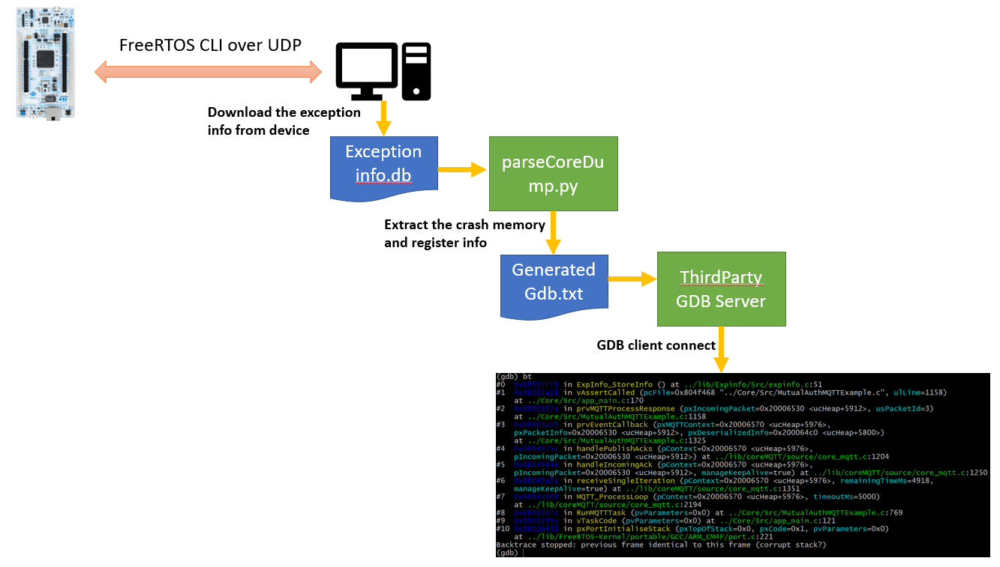

## Introduction
This utility parses the exception info database file into a readable text file. This text file can be
read as a coredump file to GDB if combined with a third party GDB server application.



#### Example commmand

```
python parseCoreDump.py 724681be0cf04730b7569039c98aa1d5

# The generated file
GeneratedGdb_1705394832.txt
```